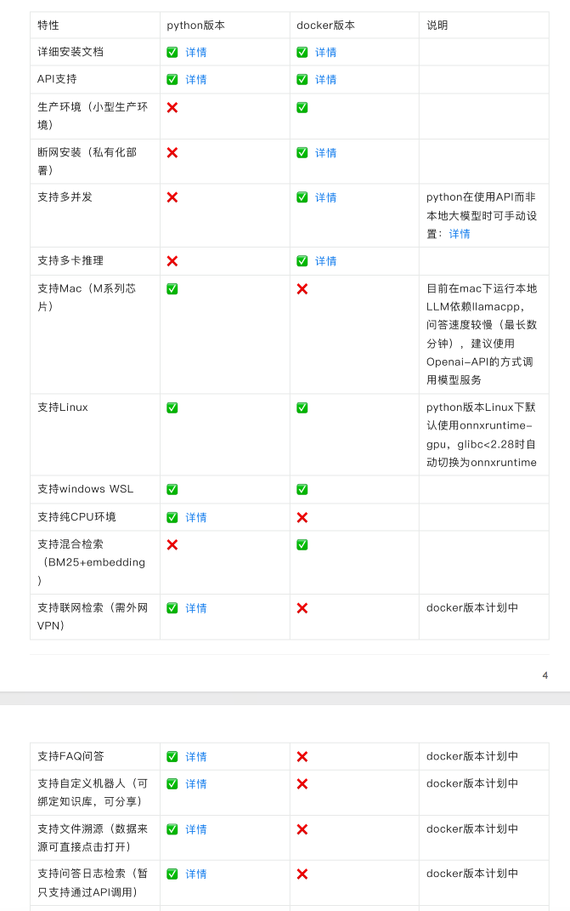
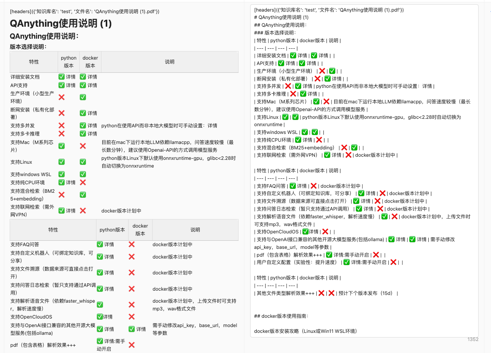
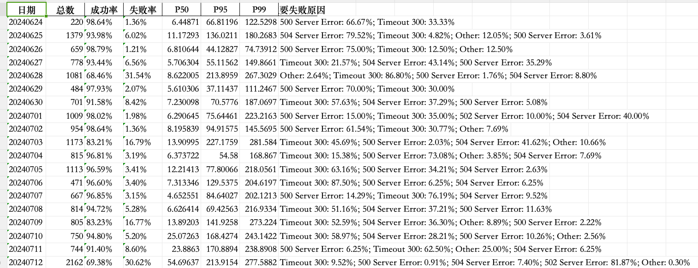
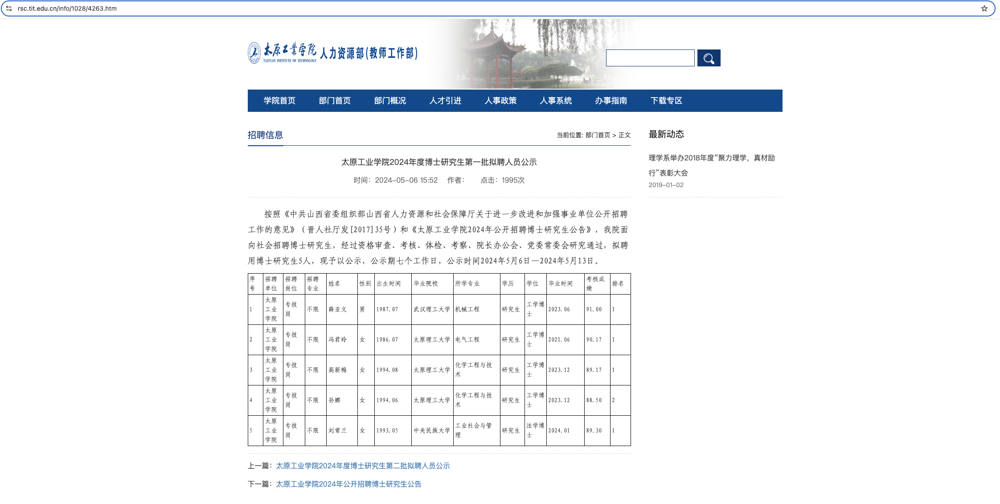
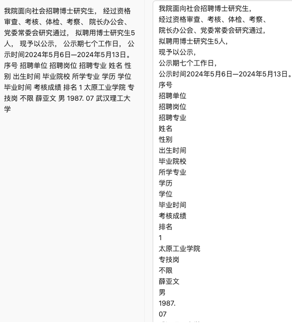
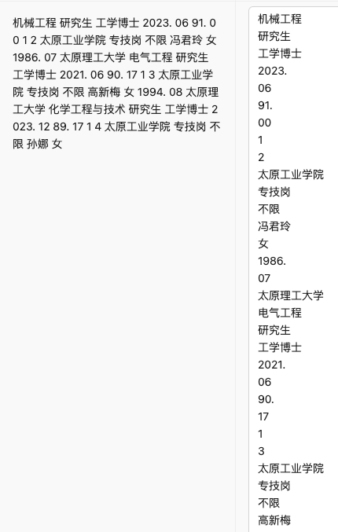
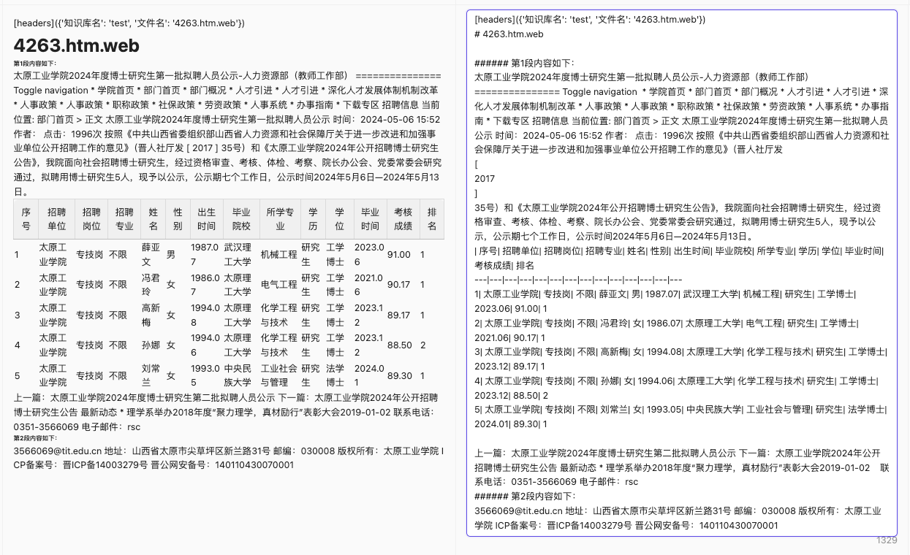
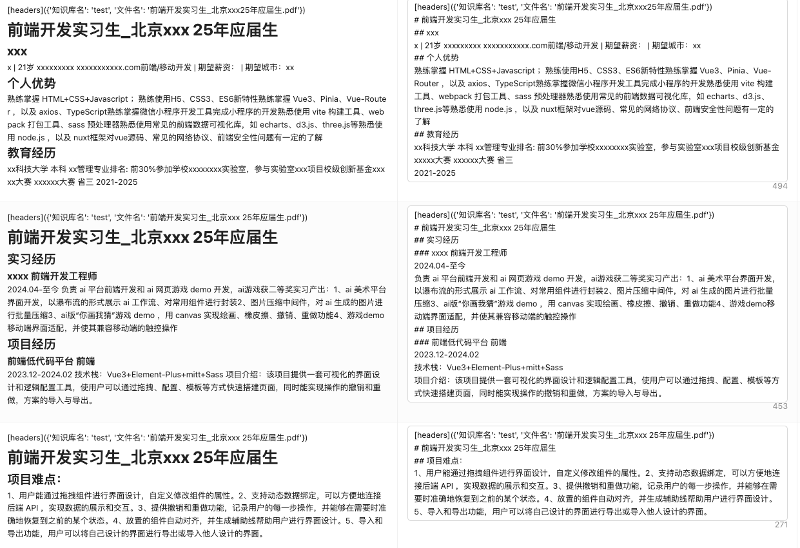

<div align="center">

  <a href="https://github.com/netease-youdao/QAnything">
    <!-- Please provide path to your logo here -->
    
  </a>

# **Q**uestion and **A**nswer based on **Anything**

<p align="center">
  <a href="./README.md">English</a> |
  <a href="./README_zh.md">简体中文</a>
</p>

</div>

<div align="center">

<a href="https://qanything.ai"></a>
&nbsp;&nbsp;&nbsp;&nbsp;
<a href="https://read.youdao.com#/home"></a>
&nbsp;&nbsp;&nbsp;&nbsp;

<a href="./LICENSE"></a>
&nbsp;&nbsp;&nbsp;&nbsp;
<a href="https://github.com/netease-youdao/QAnything/pulls"></a>
&nbsp;&nbsp;&nbsp;&nbsp;
<a href="https://twitter.com/YDopensource"></a>
&nbsp;&nbsp;&nbsp;&nbsp;

</div>

<details open="open">
<summary>目 录</summary>

- [重要更新](#-重要更新)
- [什么是QAnything](#什么是qanything)
  - [特点](#特点)
  - [架构](#架构)
- [最近更新 ](#-最近更新)
- [开始之前](#开始之前)
- [开始](#开始)
  - [最新特性表](#最新特性表)
  - [V2.0.0版本新增细节优化：](#v200版本新增细节优化)
  - [新旧解析效果对比](#新旧解析效果对比)
  - [安装](#安装)
    - [必要条件](#必要条件)
    - [step1: 下载本项目](#step1-下载本项目)
    - [step2: 进入项目根目录执行启动命令](#step2-进入项目根目录执行启动命令)
    - [step3: 开始体验](#step3-开始体验)
    - [API](#API)
    - [DEBUG](#DEBUG)
    - [关闭服务](#关闭服务)
  - [离线使用](#离线使用)
  - [常见问题](#常见问题)
  - [贡献代码](#贡献代码)
    - [感谢以下所有贡献者](#感谢以下所有贡献者)
    - [特别鸣谢](#特别鸣谢)
  - [商务问题联系方式：](#商务问题联系方式)
- [路线图&反馈](#-路线图--反馈)
- [交流&支持](#交流--支持)
  - [微信](#微信)
  - [邮箱](#邮箱)
- [协议](#协议)
- [Acknowledgements](#acknowledgements)

</details>

# 🚀 重要更新
<h1><span style="color:red;">重要的事情说三遍！</span></h1>

# [2024-08-23: QAnything更新V2.0版本]
# [2024-08-23: QAnything更新V2.0版本]
# [2024-08-23: QAnything更新V2.0版本]

<h2>

* <span style="color:green">此次更新带来了使用门槛，资源占用，检索效果，问答效果，解析效果，前端效果，服务架构，使用方式等多方面的改进。</span>
* <span style="color:green">同时合并了旧有的docker版和python版两个版本，改为全新的统一版本，采用docker compose单行命令一键启动，开箱即用。</span>

</h2>


## 欢迎贡献代码
我们感谢您对贡献到我们项目的兴趣。无论您是修复错误、改进现有功能还是添加全新内容，我们都欢迎您的贡献！

### 感谢以下所有贡献者
<a href="https://github.com/netease-youdao/QAnything/graphs/contributors">
  
</a>

### 特别鸣谢！
<h2><span style="color:red;">请注意：我们的贡献者名单是自动更新的，因此您的贡献可能不会立即显示在此列表中。</span></h2>
<h2><span style="color:red;">特别鸣谢！：@ikun-moxiaofei</span></h2>
<h2><span style="color:red;">特别鸣谢！：@Ianarua</span></h2>


## 商务问题联系方式：
### 010-82558901


# 什么是QAnything？
**QAnything** (**Q**uestion and **A**nswer based on **Anything**) 是致力于支持任意格式文件或数据库的本地知识库问答系统，可断网安装使用。

您的任何格式的本地文件都可以往里扔，即可获得准确、快速、靠谱的问答体验。

目前已支持格式: **PDF(pdf)**，**Word(docx)**，**PPT(pptx)**，**XLS(xlsx)**，**Markdown(md)**，**电子邮件(eml)**，**TXT(txt)**，**图片(jpg，jpeg，png)**，**CSV(csv)**，**网页链接(html)**，更多格式，敬请期待...

## 特点
- 数据安全，支持全程拔网线安装使用。
- 支持文件类型多，解析成功率高，支持跨语种问答，中英文问答随意切换，无所谓文件是什么语种。
- 支持海量数据问答，两阶段向量排序，解决了大规模数据检索退化的问题，数据越多，效果越好，不限制上传文件数量，检索速度快。
- 硬件友好，默认在纯CPU环境下运行，且win，mac，linux多端支持，除docker外无依赖项。
- 易用性，无需繁琐的配置，一键安装部署，开箱即用，各依赖组件（pdf解析，ocr，embed，rerank等）完全独立，支持自由替换。
- 支持类似Kimi的快速开始模式，无文件聊天模式，仅检索模式，自定义Bot模式。

## 架构
<div align="center">

</div>

### 为什么是两阶段检索?
知识库数据量大的场景下两阶段优势非常明显，如果只用一阶段embedding检索，随着数据量增大会出现检索退化的问题，如下图中绿线所示，二阶段rerank重排后能实现准确率稳定增长，即**数据越多，效果越好**。

<div align="center">

</div>

QAnything使用的检索组件[BCEmbedding](https://github.com/netease-youdao/BCEmbedding)有非常强悍的双语和跨语种能力，能消除语义检索里面的中英语言之间的差异，从而实现：
- **强大的双语和跨语种语义表征能力【<a href="https://github.com/netease-youdao/BCEmbedding/tree/master?tab=readme-ov-file#semantic-representation-evaluations-in-mteb" target="_Self">基于MTEB的语义表征评测指标</a>】。**
- **基于LlamaIndex的RAG评测，表现SOTA【<a href="https://github.com/netease-youdao/BCEmbedding/tree/master?tab=readme-ov-file#rag-evaluations-in-llamaindex" target="_Self">基于LlamaIndex的RAG评测指标</a>】。**


### 一阶段检索（embedding）
| 模型名称 | Retrieval | STS | PairClassification | Classification | Reranking | Clustering | 平均 |  
|:-------------------------------|:--------:|:--------:|:--------:|:--------:|:--------:|:--------:|:--------:|  
| bge-base-en-v1.5 | 37.14 | 55.06 | 75.45 | 59.73 | 43.05 | 37.74 | 47.20 |  
| bge-base-zh-v1.5 | 47.60 | 63.72 | 77.40 | 63.38 | 54.85 | 32.56 | 53.60 |  
| bge-large-en-v1.5 | 37.15 | 54.09 | 75.00 | 59.24 | 42.68 | 37.32 | 46.82 |  
| bge-large-zh-v1.5 | 47.54 | 64.73 | **79.14** | 64.19 | 55.88 | 33.26 | 54.21 |  
| jina-embeddings-v2-base-en | 31.58 | 54.28 | 74.84 | 58.42 | 41.16 | 34.67 | 44.29 |  
| m3e-base | 46.29 | 63.93 | 71.84 | 64.08 | 52.38 | 37.84 | 53.54 |  
| m3e-large | 34.85 | 59.74 | 67.69 | 60.07 | 48.99 | 31.62 | 46.78 |  
| ***bce-embedding-base_v1*** | **57.60** | **65.73** | 74.96 | **69.00** | **57.29** | **38.95** | ***59.43*** |  

- 更详细的评测结果详见[Embedding模型指标汇总](https://github.com/netease-youdao/BCEmbedding/blob/master/Docs/EvaluationSummary/embedding_eval_summary.md)。

### 二阶段检索（rerank）
| 模型名称 | Reranking | 平均 |  
|:-------------------------------|:--------:|:--------:|  
| bge-reranker-base | 57.78 | 57.78 |  
| bge-reranker-large | 59.69 | 59.69 |  
| ***bce-reranker-base_v1*** | **60.06** | ***60.06*** |  

- 更详细的评测结果详见[Reranker模型指标汇总](https://github.com/netease-youdao/BCEmbedding/blob/master/Docs/EvaluationSummary/reranker_eval_summary.md)

### 基于LlamaIndex的RAG评测（embedding and rerank）


***NOTE:***

- 在WithoutReranker列中，我们的bce-embedding-base_v1模型优于所有其他embedding模型。
- 在固定embedding模型的情况下，我们的bce-reranker-base_v1模型达到了最佳表现。
- **bce-embedding-base_v1和bce-reranker-base_v1的组合是SOTA。**
- 如果想单独使用embedding和rerank请参阅：[BCEmbedding](https://github.com/netease-youdao/BCEmbedding)

### LLM

v2.0版本QAnything不再提供本地大模型，用户可自行接入OpenAI接口兼容的其他开源大模型服务，如ollama, DashScope等。

# 🚀 最近更新
- ***2024-08-23***: **支持快速开始、前端配置参数、在线预览和编辑chunk块，极大优化项目架构和启动方式，极大优化解析和检索效果。** - 详见👉 [v2.0.0](https://github.com/netease-youdao/QAnything/releases/tag/v2.0.0)
- ***2024-05-20***: **支持与OpenAI API兼容的其他LLM服务，并提供优化后的PDF解析器。** - 详见👉 [v1.4.1](https://github.com/netease-youdao/QAnything/releases/tag/v1.4.1)
- ***2024-04-26***: **支持联网检索、FAQ、自定义BOT、文件溯源等。** - 详见👉 [v1.4.0](https://github.com/netease-youdao/QAnything/releases/tag/v1.4.0-python)
- ***2024-04-03***: **支持在纯Python环境中安装；支持混合检索。** - 详见👉 [v1.3.0](https://github.com/netease-youdao/QAnything/releases/tag/v1.3.0)
- ***2024-01-29***: **支持自定义大模型，包括OpenAI API和其他开源大模型，GPU需求最低降至GTX 1050Ti，极大提升部署，调试等方面的用户体验** - 详见👉 [v1.2.0](https://github.com/netease-youdao/QAnything/releases/tag/v1.2.0)
- ***2024-01-23***: **默认开启rerank，修复在windows上启动时存在的各类问题** - 详见👉 [v1.1.1](https://github.com/netease-youdao/QAnything/releases/tag/v1.1.1)
- ***2024-01-18***: **支持一键启动，支持windows部署，提升pdf，xlsx，html解析效果** - 详见👉 [v1.1.0](https://github.com/netease-youdao/QAnything/releases/tag/v1.1.0)

# 开始之前
**在GitHub上加星，即可立即收到新版本的通知！**

* [🏄 在线试用QAnything](https://qanything.ai)
* [📚 在线试用有道速读](https://read.youdao.com)
* [🛠️ 想只使用BCEmbedding(embedding & rerank)](https://github.com/netease-youdao/BCEmbedding)
* [📖 FAQ](FAQ_zh.md)
* [👂️需求反馈 | 让我听见你的声音](https://qanything.canny.io/feature-requests)


# 开始
## 最新特性表

| 特性                              | python （v1.4.2） | docker （v1.2.2） | 全新QAnything v2.0.0 | 说明                                                                        |
|---------------------------------|-----------------|-----------------| ---------------- |---------------------------------------------------------------------------|
| 详细安装文档                          | ✅               | ✅               | ✅                |                                                                           |
| API支持                           | ✅               | ✅               | ✅                |                                                                           |
| 生产环境（小型生产环境）                    | ❌               | ✅               | ✅                |                                                                           |
| 离线使用                            | ❌               | ✅               | ✅                |                                                                           |
| 支持多并发                           | ❌               | ✅               | ✅                |                                                                           |
| 支持多卡推理                          | ❌               | ✅               | ❌                | v2.0.0版本不再提供默认本地LLM，一律通过openai接口接入，用户可自行通过ollama等工具部署本地LLM                |
| 支持Mac（M系列芯片）                    | ✅               | ❌               | ✅                |                                                                           |
| 支持Linux                         | ✅               | ✅               | ✅                | python旧版本Linux下默认使用onnxruntime-gpu for cuda12，glibc<2.28时自动切换为onnxruntime |
| 支持windows （**无需WSL**）               | ❌               | ❌               | ✅                | python和docker旧版本均要求WSL环境，v2.0.0可直接在非WSL环境下启动                              |
| 支持纯CPU环境                        | ✅               | ❌               | ✅                | v2.0.0版本Mac，Linux，Win统一不再使用GPU，完全迁移至CPU                                   |
| 支持混合检索（BM25+embedding）          | ❌               | ✅               | ✅                |                                                                           |
| 支持联网检索（**需外网VPN**）                  | ✅               | ❌               | ✅                |                                                                           |
| 支持FAQ问答                         | ✅               | ❌               | ✅                |                                                                           |
| 支持自定义机器人（可绑定知识库，可分享）            | ✅               | ❌               | ✅                |                                                                           |
| 支持文件溯源（数据来源可直接点击打开）             | ✅               | ❌               | ✅                |                                                                           |
| 支持问答日志检索             | ✅               | ❌               | ✅                | python和docker旧版本均只能通过API检索，v2.0.0可直接在前端检索                                 |
| 支持解析语音文件（依赖faster_whisper，解析速度慢） | ✅               | ❌               | ❌                | 依赖whisper，速度慢且占用资源大，暂时去除                                                  |
| 支持OpenCloudOS                   | ✅               | ❌               | ✅                |                                                                           |
| 支持与OpenAI接口兼容的其他开源大模型服务(包括ollama) | ✅               | ✅               | ✅                | python和docker旧版本需手动修改api_key，base_url，model等参数，v2.0.0版本均改为前端设置自动保存        |
| pdf（包含表格）解析效果+++                | ✅               | ❌               | ✅                | v1.4.2版本需手动设置，v2.0.0无需手动设置，pdf解析效果和性能均有提升                                 |
| 用户自定义embed，rerank配置（实验性：提升速度）   | ✅               | ❌               | ✅                | v1.4.2需手动设置，v2.0.0默认使用最佳配置                                                |
| 其他文件类型解析效果+++                   | ❌               | ❌               | ✅                | v2.0.0版本提升url，md，xlsx，docx等解析效果                                           |
| 支持独立服务调用                        | ❌               | ❌               | ✅                | v2.0.0版本独立依赖服务，包括embed，rerank，ocr，pdf解析服务等，可独立调用（http）                    |
| 支持快速开始模式                        | ❌               | ❌               | ✅                | 快速开始：无需创建知识库，支持文件即传即问，支持无文件问答                                             |
| 支持仅检索模式                         | ❌               | ❌               | ✅                | 仅返回检索结果，不调用大模型进行问答                                                        |
| 支持解析结果chunks内容可视化，手动编辑          | ❌               | ❌               | ✅                | v2.0.0版本支持手动编辑chunks内容，实时生效                                               |
| pdf解析支持图片,支持回答带图                | ❌               | ❌               | ✅                |                                                                           |

## V2.0.0版本新增细节优化：

* 支持前端配置API_BASE，API_KEY，文本分片大小，输出token数量，上下文消息数量等参数
* 优化Bot角色设定的指令遵循效果，每个Bot可单独配置模型参数
* 支持创建多个对话窗口，同时保存多份历史问答记录
* 支持问答记录保存成图片
* 优化上传文件逻辑，解析文件与问答请求独立，上传文件不再影响问答
* 优化镜像大小，旧版本镜像压缩后大小为18.94GB->新版镜像压缩后大小为4.88GB，降为原有的1/4，提供完整Dockerfile
* 检索优化，chunks新增片段融合与排序，聚合单文档或双文档
* 检索阶段和问答阶段均嵌入metadata信息，提升检索和问答效果
  
### 各阶段数据展示：
* 知识库所有文件上传进度展示
* 知识库单个文件上传进度展示，上传各阶段耗时
* 问答信息统计，包含问答各阶段耗时，tokens消耗，模型信息等
* 用户信息统计，包含上传文件总数量，总耗时，问答历史记录等
  
### 问题修复
* xlsx表格支持多sheet解析
* 优化PDF表格漏识别问题
* 修复部分DOCX文件解析出错问题
* 优化FAQ匹配逻辑
* 支持非utf-8编码的txt文件


## 新旧解析效果对比
* 针对PDF文档：首先针对在文档中大段表格，尤其是跨页表格的解析方面，2.0版本进行了显著的改进，新版本解析逻辑能够分析表格的结构，包括行和列的布局，并且能够自动识别出表头，将其置于每个切片分割出的表格的顶部。这样的改进防止了在解析长表格时，由于逻辑上的切割而导致的意义上的中断

| 原图 | 旧版本解析效果 | 新版本解析效果 |
|:----:|:--------------------------------------------:|:---------------------------------------------------------------------------------------------:|
|  |  |  |

* 此外，2.0版本在处理文本分栏和跨页布局的情况下也做了优化。它能够识别文本的双栏或多栏布局，并根据人类的阅读习惯来正确划分文本块的顺序。同时，该版本还能够保存文档中的图片，确保在文件解析过程中内容的完整性不会丢失。如在下图中，正确的排列顺序应该为一次排列编号1，2，3的文本为一大段并进行切块，而不是将1，2，3分别切块。
  * 在1.4版本解析结果中，跨页文本 “更高一些” 被分块到了下一文本块中，这对大模型语义理解是不利的，而在2.0版本解析结果中是正确划分的，并且也将穿插在文本段落中的图片解析到对应的chunk语句块中，非正文本文 “图1  鉴别与授权及其支持关系  37” 和 “Cover Story 封面专题” 也成功被过滤

| 原图 | 旧版本解析效果 | 新版本解析效果 |
|:----:|:--------------------------------------------:|:---------------------------------------------------------------------------------------------:|
|  | <br/> |  |


* 2.0版本在针对穿插在文本栏或文本块之间的表格解析也做了相应的优化，原先版本的解析无法识别表格，只会将其以文本段落的格式进行解析，这样不仅会破坏表格的逻辑结构，对大模型而言也是多了一段杂乱无用的文本，会影响大模型回答的准确度；而2.0版本能够识别并解析这些嵌入文本中的表格，从而提高了解析的质量和大模型回答的准确性。
  * 在1.4版本解析结果中，穿插在文本块中的表格被当做普通文本块解析，2.0版本这可以将这种表格“优雅地”解析，不仅提高了解析的质量也增加大模型回答的准确性；
  * 此外，2.0版本在处理特定小标题下的文本时，会优先确保这些文本被分割到同一个chunk块中，以维持逻辑上的连贯性。当文本过长，需要进行分割时，2.0版本的解析逻辑会在每个分割后的文本块前重复相同的小标题，以示归属。例如，在示例中，三个文本块都加上了相同的小标题“欧洲会议：机器人的法律地位”（由于文本过长，在原文件截图时未能显示该标题）。这种处理方式有效避免了因文本过长而导致的分割后文本块语义逻辑不连贯的问题。

| 原图 | 旧版本解析效果 | 新版本解析效果 |
|:----:|:--------------------------------------------:|:---------------------------------------------------------------------------------------------:|
|  |  |  |

* 对于包含复杂格式的Excel（.xlsx）文档，2.0版本进行了一系列的优化措施，可以准确地识别和处理行列数据，包括合并单元格和跨行或跨列的文本等优化，具体可以看以下示例。
  * 在1.4版本中，解析Excel文档时可能存在一些限制，特别是对于包含特殊结构或格式的文档，解析结果可能不尽如人意，主要只能识别纯文本部分。这在处理复杂数据和格式时可能导致信息丢失或格式错乱。相比之下，2.0版本在解析能力上有了显著提升，能够更好地处理各种复杂格式的Excel文档，尽管可能还未达到完美，但已经能够解决绝大多数复杂情况。

| 原图 | 旧版本解析效果 | 新版本解析效果 |
|:----:|:--------------------------------------------:|:---------------------------------------------------------------------------------------------:|
|  |  |  |

* 同样，对于简单格式的xlsx文档，2.0版本的解析也做了优化。

| 原图 | 旧版本解析效果 | 新版本解析效果 |
|:----:|:--------------------------------------------:|:---------------------------------------------------------------------------------------------:|
|  |  |  |

* 在最新版本中，我们对URL解析功能也进行了显著改进。以下面的页面为例，旧版本在解析过程中可能会遗漏大量页面信息，并且无法有效处理表格、列表等较为复杂的页面元素。然而，新版本已经针对这些问题进行了优化，能够更准确地解析这些内容。

| 原图 | 旧版本解析效果 | 新版本解析效果 |
|:----:|:--------------------------------------------:|:---------------------------------------------------------------------------------------------:|
|  | <br/> |  |

* 除此之外，对于绝大多数的文件，2.0版本也做了对应的优化，包括但不限于以下几点 
  * 改进了chunk块的切割逻辑，避免了由于文档中的空白行或段落导致的语义块过短或逻辑中断，确保了文本块的连贯性和完整性
  * 新版本能够更准确地识别文档中的小标题，并根据这些小标题来定位和组织对应的文本块，有助于优化解析效果，使得解析的结构更加清晰，信息层次更加分明
  * 解析结果对比如下，1.4版本解析逻辑将文档分为了10个chunk块，而2.0版本解析后只有4个chunk块，更加合理且较少的chunk块极大的提高了内容的连贯性和完整性，有助于减少因切割不当而导致的语义断裂或逻辑混乱，从而提高了整体的解析效果和模型回答的效果

| 原图 | 旧版本解析效果 | 新版本解析效果 |
|:----:|:--------------------------------------------:|:---------------------------------------------------------------------------------------------:|
|  |  |  |

### 综上所述，2.0版本解析相较于1.4版本的解析优化了很多方面，包括但不限于

1. 通过更合理的分块长度，减少了因段落过小或段落不完整而导致的语义和逻辑上的丢失。
2. 改进了对分栏文本的识别能力，能够智能判断阅读顺序，即使是跨页的段落也能做出正确处理。
3. 新版本能够识别并保存文本段落中的图片和表格，确保不会遗漏任何重要的文本信息。
4. 优化表格解析，包括超出chunk块限制的长表格和复杂结构的xlsx文件的解析和存储
5. 根据识别文档中的小标题，定位和组织对应的文本块，使得解析的结构更加清晰，信息层次更加分明
6. 优化对于网页url的解析结果，转为.md格式
7. 支持更多编码格式的txt文件和docx文件


## 安装
### 必要条件
| **系统**    | **依赖**                  | **要求**            | **说明**                                                                                 |
|-----------|-------------------------|-------------------|----------------------------------------------------------------------------------------|
|           | RAM Memory              | >= 20GB           |                                                                                        |
| Linux/Mac | Docker version          | >= 20.10.5        | [Docker install](https://docs.docker.com/engine/install/)                              |
| Linux/Mac | docker compose  version | >= 2.23.3         | [docker compose install](https://docs.docker.com/compose/install/)                     |
| Windows   | Docker Desktop          | >= 4.26.1（131620） | [Docker Desktop for Windows](https://docs.docker.com/desktop/install/windows-install/) |


### step1: 下载本项目
```shell
git clone https://github.com/netease-youdao/QAnything.git
```
### step2: 进入项目根目录执行启动命令
* 执行 docker compose 启动命令
* **启动过程大约需要30秒左右，当日志输出"qanything后端服务已就绪!"后，启动完毕！** 
```shell
cd QAnything
# 在 Linux 上启动
docker compose -f docker-compose-linux.yaml up
# 在 Mac 上启动
docker compose -f docker-compose-mac.yaml up
# 在 Windows 上启动
docker compose -f docker-compose-win.yaml up
```

（注意）如果启动失败，可以尝试将 `docker compose`改为 `docker-compose`。
（注意）镜像手动下载地址：
- [win](https://pan.baidu.com/s/1tVZ7J-3dwblvRGv1-N6J5A?pwd=bfna)
- [mac](https://pan.baidu.com/s/1lxUq0ZOIzVCa3RXTp6Uozg?pwd=5w4i)
- [linux](https://pan.baidu.com/s/1kqyGhBOUjBfk8zAeaVddzg?pwd=j72b)
加载方式：
```shell
docker load -i qanything_xxx.tar
```

### step3: 开始体验

#### 前端页面
运行成功后，即可在浏览器输入以下地址进行体验。

- 前端地址: http://localhost:8777/qanything/

### API
如果想要访问API接口，请参考下面的地址:
- API address: http://localhost:8777/api/
- For detailed API documentation, please refer to [QAnything API 文档](docs/API.md)

### DEBUG
##### 如果想要查看服务启动相关日志，请查看`QAnything/logs/debug_logs`目录下的日志文件。
- **debug.log**
  - 用户请求处理日志
- **main_server.log**
  - 后端服务运行日志
- **rerank_server.log**
  - rerank服务运行日志
- **ocr_server.log**
  - OCR服务运行日志
- **embedding_server.log**
  - 向量化服务运行日志
- **rerank_server.log**
  - 检索增强服务运行日志
- **insert_files_server.log**
  - 文件上传服务运行日志
- **pdf_parser_server.log**
  - pdf解析服务运行日志
##### 详细上传文件日志请查看`QAnything/logs/insert_logs`目录下的日志文件。
##### 详细问答日志请查看`QAnything/logs/qa_logs`目录下的日志文件。
##### 详细embedding日志请查看`QAnything/logs/embed_logs`目录下的日志文件。
##### 详细rerank日志请查看`QAnything/logs/rerank_logs`目录下的日志文件。

### 关闭服务
```shell
# 前台启动服务方式如下：
docker compose -f docker-compose-xxx.yaml up # 关闭服务请按Ctrl+C
# 后台启动服务方式如下：
docker compose -f docker-compose-xxx.yaml up -d  # 关闭服务请执行以下命令
docker compose -f docker-compose-xxx.yaml down
```

## 离线使用
如果您想要离线使用QAnything，需要在断网机器提前部署本地的大模型（推荐使用ollama），随后可以使用以下命令启动服务。
### windows离线使用
```shell 
# 先在联网机器上下载docker镜像
docker pull quay.io/coreos/etcd:v3.5.5
docker pull minio/minio:RELEASE.2023-03-20T20-16-18Z
docker pull milvusdb/milvus:v2.4.8
docker pull mysql:8.4
docker pull xixihahaliu01/qanything-win:v1.5.1  # 从 [https://github.com/netease-youdao/QAnything/blob/master/docker-compose-windows.yaml#L103] 中获取最新镜像版本号。

# 打包镜像
docker save quay.io/coreos/etcd:v3.5.5 minio/minio:RELEASE.2023-03-20T20-16-18Z milvusdb/milvus:v2.4.8 mysql:8.4 xixihahaliu01/qanything-win:v1.5.1 -o qanything_offline.tar

# 下载QAnything代码
wget https://github.com/netease-youdao/QAnything/archive/refs/heads/master.zip

# 把镜像qanything_offline.tar和代码QAnything-master.zip拷贝到断网机器上
cp QAnything-master.zip qanything_offline.tar /path/to/your/offline/machine

# 在断网机器上加载镜像
docker load -i qanything_offline.tar

# 解压代码，运行
unzip QAnything-master.zip
cd QAnything-master
docker compose -f docker-compose-win.yaml up
```

### Linux离线使用
```shell 
# 先在联网机器上下载docker镜像
docker pull quay.io/coreos/etcd:v3.5.5
docker pull minio/minio:RELEASE.2023-03-20T20-16-18Z
docker pull milvusdb/milvus:v2.4.8
docker pull mysql:8.4
docker pull xixihahaliu01/qanything-linux:v1.5.1  # 从 [https://github.com/netease-youdao/qanything/blob/master/docker-compose-linux.yaml#L104] 中获取最新镜像版本号。

# 打包镜像
docker save quay.io/coreos/etcd:v3.5.5 minio/minio:RELEASE.2023-03-20T20-16-18Z milvusdb/milvus:v2.4.8 mysql:8.4 xixihahaliu01/qanything-linux:v1.5.1 -o qanything_offline.tar

# 下载QAnything代码
wget https://github.com/netease-youdao/QAnything/archive/refs/heads/master.zip

# 把镜像qanything_offline.tar和代码QAnything-master.zip拷贝到断网机器上
cp QAnything-master.zip qanything_offline.tar /path/to/your/offline/machine

# 在断网机器上加载镜像
docker load -i qanything_offline.tar

# 解压代码，运行
unzip QAnything-master.zip
cd QAnything-master
docker compose -f docker-compose-linux.yaml up
```

## 常见问题
### 目前最常见的问题是ollama本地服务问答效果不佳，可以参考faq中的解决方案
[常见问题](FAQ_zh.md)

## 贡献代码
我们感谢您对贡献到我们项目的兴趣。无论您是修复错误、改进现有功能还是添加全新内容，我们都欢迎您的贡献！

### 感谢以下所有贡献者
<a href="https://github.com/netease-youdao/QAnything/graphs/contributors">
  
</a>

# 🛣️ 路线图 & 反馈
🔎 想了解QAnything的未来规划和进展，请看这里： [QAnything Roadmap](https://qanything.canny.io/)

🤬 想要给QAnything提交反馈，请看这里(可以给每个功能需求投票哦): [QAnything Feedbak](https://qanything.canny.io/feature-requests)

# 交流 & 支持

## Discord <a href="https://discord.gg/5uNpPsEJz8"></a>
欢迎加入QAnything [Discord](https://discord.gg/5uNpPsEJz8) 社区！


## 微信
欢迎关注微信公众号，获取最新QAnything信息


欢迎扫码进入QAnything交流群


## 邮箱
如果你需要私信我们团队，请通过下面的邮箱联系我们：

qanything@rd.netease.com

## GitHub issues & discussions
有任何公开的问题，欢迎提交issues，或者在discussions区讨论
- [Github issues](https://github.com/netease-youdao/QAnything/issues)
- [Github discussions](https://github.com/netease-youdao/QAnything/discussions)

<a href="https://github.com/netease-youdao/QAnything/discussions">
  <!-- Please provide path to your logo here -->
  
</a>

# Star History

[](https://star-history.com/#netease-youdao/QAnything&netease-youdao/BCEmbedding&Date)

# 协议

`QAnything` 依照 [AGPL-3.0](./LICENSE)开源。

# Acknowledgements
- [BCEmbedding](https://github.com/netease-youdao/BCEmbedding)
- [Qwen](https://github.com/QwenLM/Qwen)
- [Triton Inference Server](https://github.com/triton-inference-server/server)
- [vllm](https://github.com/vllm-project/vllm)
- [FastChat](https://github.com/lm-sys/FastChat)
- [FasterTransformer](https://github.com/NVIDIA/FasterTransformer)
- [Langchain](https://github.com/langchain-ai/langchain)
- [Langchain-Chatchat](https://github.com/chatchat-space/Langchain-Chatchat)
- [Milvus](https://github.com/milvus-io/milvus)
- [PaddleOCR](https://github.com/PaddlePaddle/PaddleOCR) 
- [Sanic](https://github.com/sanic-org/sanic)
- [RAGFlow](https://github.com/infiniflow/ragflow)